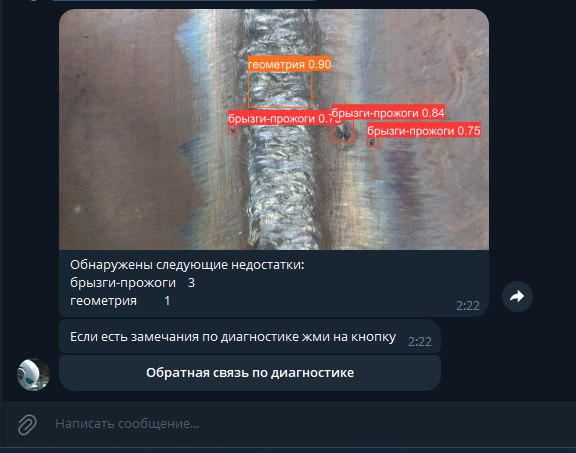

### Описание проекта:
Проект Telegram-бота для визуальной диагностики сварных соединений средствами YOLO.
Проект представляет собой Telegram-бота, который позволяет проводить визуальную диагностику сварных соединений с помощью модели YOLO. 
Пользоваться очень просто:
- запускаете бот
- загружаете фото
- получите результат диагностики от бота, 
- если есть замечания по диагностике описываете ее нажав соответствующую кнопку.



Если совершенно случайно у Вас нет под рукой фото сварных швов вот парочка для примера:
- [файл 1](https://disk.yandex.ru/i/Szd1nV6vcM6-lw)
- [файл 2](https://disk.yandex.ru/i/NuQ8paKFZnEfjA)
- [файл 3](https://disk.yandex.ru/i/vCFs5cyH7pPS3g)

Важно! На текущем этапе данный проект является демонстратором возможностей микросервиса для детекции дефектов сварных швов. Сервис не предназначен для большого числа одновременно работающих пользователей и высокой точности диагностики.
Тем не менее вы можете опробовать данный сервис, найдя в Telegram бота @AI_weld_bot.

Этот сервис может быть интересен малым и средним производственным предприятиям в качестве сервиса по подписке. Если вас заинтересовал данный сервис или у вас есть идеи по подобным сервисам, пожалуйста, свяжитесь со мной по адресу @borisfox или demkov.boris@yandex.ru.

Благодарности:
- [Росатому](https://www.rosatom.ru/index.html) за предоставленный датасет для обучения;
- [Yandex Datasphere](https://yandex.cloud/ru/services/datasphere) за облачный ресурс для обучения модели;
- [YOLO](https://github.com/ultralytics/assets/releases/tag/v8.2.0) за модель;
- [Cloud.ru](https://cloud.ru/ru) — за хостинг Telegram-бота;
- [Telegram](https://web.telegram.org/) — за прекрасный мессенджер.


### Как запустить проект:

1. Клонировать репозиторий и перейти в него в командной строке:

```
git clone https://github.com/AIofHuman/weld-defect-detect.git
```

```
cd weld-defect-detect
```

2. Создать и заполнить файл .env.
3. Собрать docker image:

```
docker build -t ai_weldbot .
```
4. Запустить docker контейнер
```
docker run ai_weldbot
```
